# Kubernetes Interview Questions and Answers for 2 Years Experience

## 1. What is Kubernetes?

Kubernetes is an open-source container orchestration platform that automates the deployment, scaling, and management of containerized applications.

## 2. What are the main components of Kubernetes?

- **Master Node Components:** API Server, Controller Manager, Scheduler, etcd.
- **Worker Node Components:** Kubelet, Kube Proxy, Container Runtime.

## 3. What is a Pod in Kubernetes?

A Pod is the smallest deployable unit in Kubernetes that can contain one or more containers sharing storage and network.

## 4. What is the difference between a Deployment and a StatefulSet?

- **Deployment:** Used for stateless applications, supports rolling updates.
- **StatefulSet:** Used for stateful applications, provides stable network identity and persistent storage.

## 5. How do you check the logs of a Pod?

```sh
kubectl logs <pod-name>
```

## 6. How do you expose a Pod’s service?

Using a Service:

```sh
kubectl expose pod <pod-name> --type=NodePort --port=80
```

## 7. What are Namespaces in Kubernetes?

Namespaces help in logically dividing cluster resources among multiple users or teams.

## 8. What is the role of etcd in Kubernetes?

Etcd is a distributed key-value store used to store cluster state and configuration data.

## 9. How does Kubernetes handle networking?

Kubernetes provides a flat network that allows Pods to communicate with each other using CNI (Container Network Interface) plugins.

## 10. What is the difference between a ConfigMap and a Secret?

- **ConfigMap:** Stores non-sensitive configuration data.
- **Secret:** Stores sensitive data, such as passwords and API keys, in an encoded format.

## 11. How do you scale a Deployment in Kubernetes?

```sh
kubectl scale deployment <deployment-name> --replicas=3
```

## 12. What is a DaemonSet?

A DaemonSet ensures that a copy of a specific Pod runs on all or some nodes.

## 13. What is a Persistent Volume (PV) and Persistent Volume Claim (PVC)?

- **PV:** A cluster-wide storage resource.
- **PVC:** A request for storage by a user or application.

## 14. How do you troubleshoot a failing Pod?

- Check logs: `kubectl logs <pod-name>`
- Describe the Pod: `kubectl describe pod <pod-name>`
- Check events: `kubectl get events`

## 15. How do you delete a Pod?

```sh
kubectl delete pod <pod-name>
```

## 16. What are Init Containers in Kubernetes?

Init Containers run before the main application container starts, performing setup tasks.

## 17. What is a Service in Kubernetes?

A Service exposes a set of Pods as a network service, enabling communication between them.

## 18. What is a Helm Chart?

Helm is a package manager for Kubernetes, and a Helm Chart is a pre-configured Kubernetes application template.

## 19. What is the difference between ClusterIP, NodePort, and LoadBalancer?

- **ClusterIP:** Internal access only.
- **NodePort:** Exposes the service on a port across all nodes.
- **LoadBalancer:** Uses an external load balancer.

## 20. How do you update an existing Deployment?

```sh
kubectl set image deployment/<deployment-name> <container-name>=<new-image>
```

## 21. What is a Horizontal Pod Autoscaler (HPA)?

HPA automatically scales the number of Pods based on CPU or memory usage.

## 22. What is the difference between a Job and a CronJob?

- **Job:** Runs a task once until completion.
- **CronJob:** Runs tasks on a scheduled basis.

## 23. How do you restart a Pod in Kubernetes?

```sh
kubectl rollout restart deployment <deployment-name>
```

## 24. What is a ReplicaSet?

A ReplicaSet ensures that a specified number of Pod replicas are running at all times.

## 25. What is the difference between `kubectl apply` and `kubectl create`?

- **kubectl create:** Used for creating new resources.
- **kubectl apply:** Used for updating existing resources.

---

This document covers essential Kubernetes interview questions for candidates with 2 years of experience. For more in-depth topics, continue exploring Kubernetes official documentation and real-world hands-on practice.

# Scenario Based Questions

1. You have an application deployed on Kubernetes that is experiencing increased traffic. How would you scale the application to handle the increased load?
   To scale the application, I would follow these steps:

- Identify the bottleneck: Analyze resource utilization, including CPU, memory, and network, to determine the limiting factor.
- Horizontal scaling: If the bottleneck is CPU or memory, I would scale the application horizontally by increasing the number of replicas using a Horizontal Pod Autoscaler (HPA).
- Vertical scaling: If the bottleneck is resource-specific, I would vertically scale the application by upgrading the resources allocated to each pod.
- Monitor and validate: Monitor the application’s performance after scaling to ensure the desired scalability is achieved without impacting stability.
  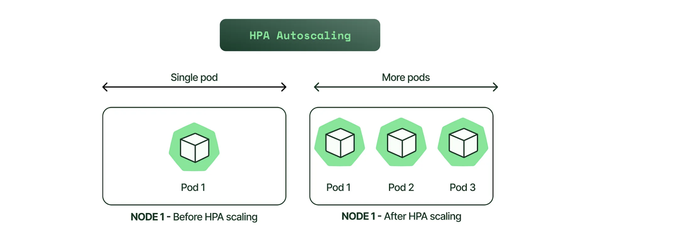

2. While troubleshooting a networking issue in the cluster, you noticed kube-proxy in the logs. What is the role of kube-proxy in Cluster?

Kube-proxy is a component in Kubernetes that runs on each node. It handles TCP/UDP packet forwarding between backend network services. It’s crucial for reliable communication between pods and services within the cluster by routing traffic to the right destination.


3. Your team is planning a high-availability Kubernetes cluster. Describe the Process and Considerations for Designing a High-Availability Kubernetes Cluster.

To create a high-availability Kubernetes cluster, we followed these steps and considerations in our previous project :

- Multi-Master Setup: We deployed multiple master nodes across three availability zones to ensure redundancy and fault tolerance. This setup prevents a single point of failure at the master level.
- etcd Distribution: We distributed etcd members across the availability zones in a similar fashion as the master nodes. This ensures data redundancy and resilience against zone failures.
- Load Balancing: We configured a TCP load balancer to evenly distribute API requests among the API servers. This setup eliminates the risk of a single API server becoming a bottleneck or point of failure.
- Node Auto-Repair: We enabled node auto-repair feature provided by Kubernetes Engine. This feature automatically detects and replaces unhealthy nodes, maintaining the desired cluster size and health without manual intervention.
  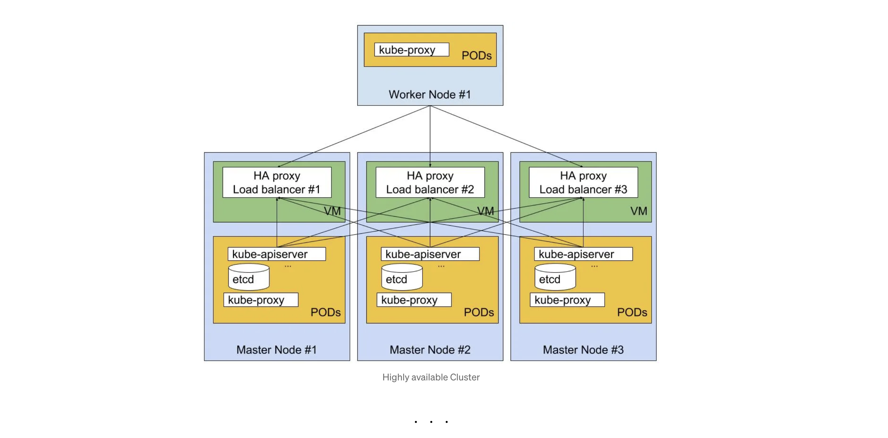

4. In your Kubernetes environment, a master or worker node suddenly fails. What happens when the master or the worker node fails?

In a Kubernetes environment:

- Master Node Failure: The cluster continues to operate normally. However, pod management is lost.
- Worker Node Failure: DNS failures may occur on the worker node, but the master node remains operational. Kubernetes handles node failures by marking them as NotReady, evicting pods, and restarting them within 1 to 7 minutes.
- The scheduler ensures uninterrupted service availability by recreating terminated pods on other healthy worker nodes.
  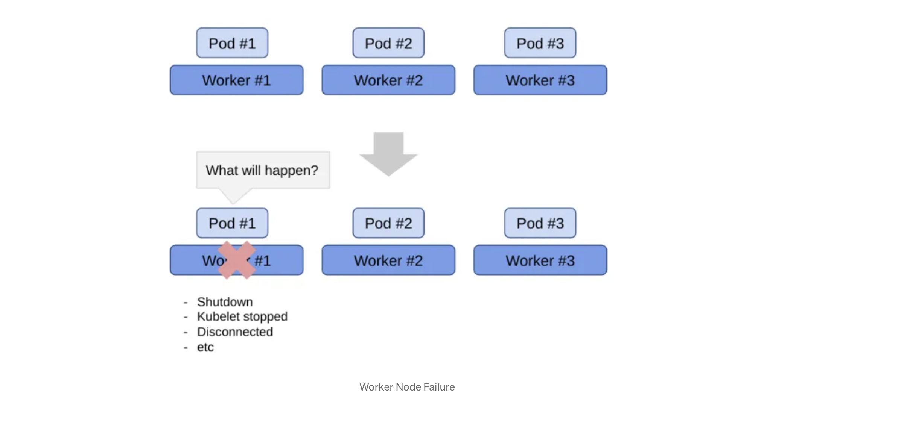

5. How does ingress help in Kubernetes?

Ingress is a resource that defines rules to expose services to external traffic. Ingress helps in Kubernetes by allowing you to:

- Expose your services to the internet or other networks using a single IP address or domain name
- Route the traffic to your services based on the host name or path
- Provide features such as load balancing, SSL termination, name-based virtual hosting, etc.
- Simplify the management and configuration of your services
  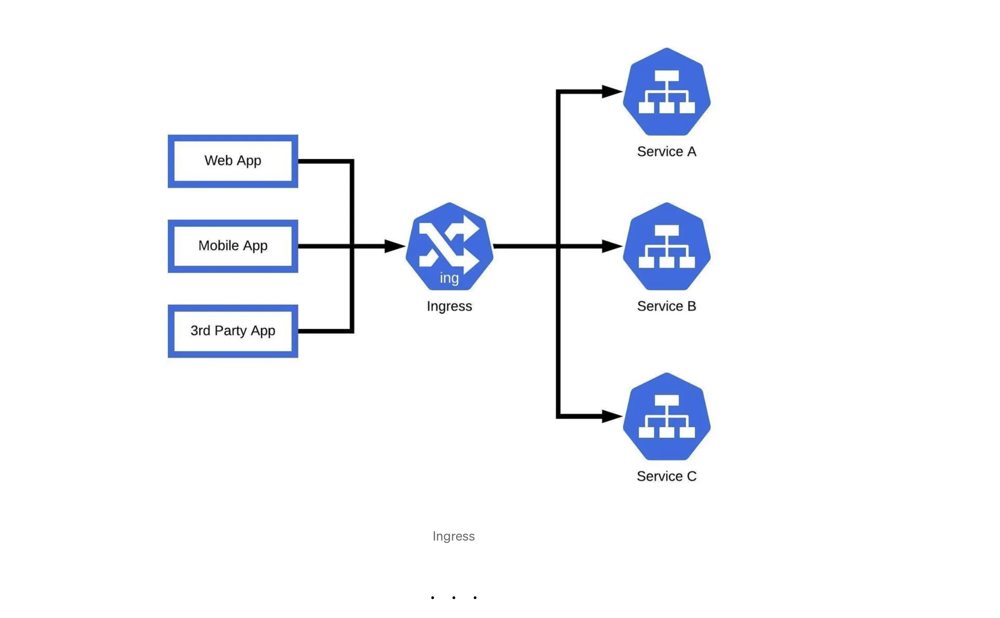

6. You’re selecting a service to expose your application hosted on Kubernetes. List the different types of services in Kubernetes.

Different types of services in Kubernetes:

- Cluster IP: (Default) Exposes the service on a cluster-internal IP, accessible only within the cluster.
- Node Port: Exposes the service on a static port on each node in the cluster, making it accessible from outside the cluster.
- Load Balancer: Provisions an external load balancer in the cloud infrastructure, directing traffic to the Kubernetes service and exposing it to the internet.
- External Name: Maps the service to an external DNS name, enabling referencing of external services by name from within the cluster.
  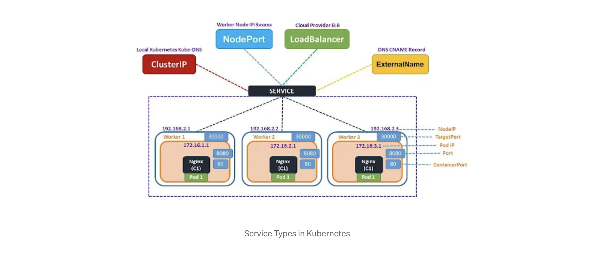

7. What do you know about Headless service?

A Headless Service in Kubernetes is a type of service that doesn’t allocate a cluster IP. So here, the spec.clusterIP is explicitly set to “None,” and the spec.type is set to “ClusterIP.”

This service is used for stateful apps, such as databases, where it is essential to maintain a consistent network identity for each instance. With Headless service, you don’t need the proxy to reach the pods.
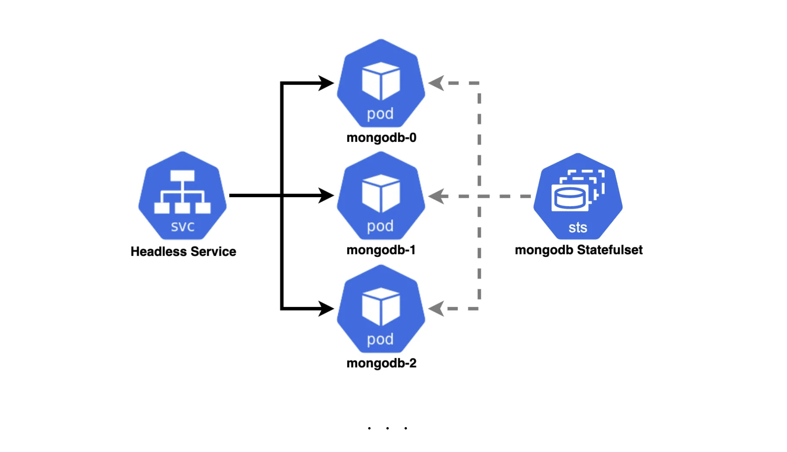

8. Your manager has instructed you to run several scripts before starting the main application in your Kubernetes pod, and suggested using init containers. What is the init container?

An init container is a type of container in Kubernetes that runs before the main application containers in a pod.

The purpose of an init container is to perform initialization tasks or setup procedures that are not present in the application container images.

Examples of tasks that an init container might perform include downloading configuration files, setting up a network connection, or initializing a database schema.
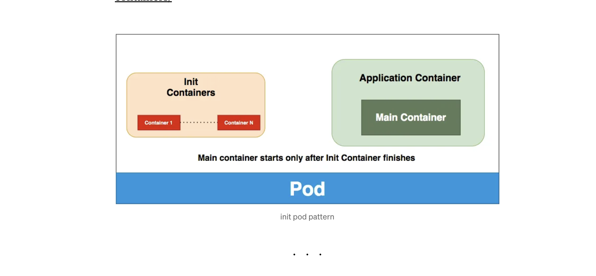

9. A Critical application running on one of nodes is not working properly. How do you monitor applications in Kubernetes?

To monitor applications on Kubernetes:

- Collect container metrics (CPU, memory) using tools like cAdvisor or container runtimes.
- Utilize Kubernetes-native monitoring tools for cluster-level metrics (e.g., kube-state-metrics, Metrics Server).
- Gather application logs with logging solutions like EFK stack or loki/Prometheus/Grafana.
- Implement readiness and liveness probes for application health.
- Set up alerting with tools like Prometheus Alertmanager.
- Other 3rd Party cluster monitoring solutions like Prometheus Operator or cloud-native offerings.

10. Your manager read an article on GitOps and want you to do POC on it. What is GitOps and How do you implement it?

For Kubernetes, GitOps is a practice where all Kubernetes configuration, including manifests and Helm charts, is stored in a Git repository. Changes to the configuration trigger automated deployment pipelines, ensuring that the cluster’s desired state matches the code in the repository. This approach streamlines management, promotes collaboration, and provides a clear audit trail for Kubernetes deployments. Tools like ArgoCD can be used to implement it.

11. Company is very concerned about Securing Clusters. List some security measures that you can take while using Kubernetes.

- RBAC: Restrict access based on user roles.
- Network Policies: Control pod-to-pod and external communication.
- Container Security: Ensure secure runtimes and image scanning.
- Secrets Management: Safeguard sensitive data with Kubernetes secrets.
- Audit Logging: Track activities for security monitoring.
- Update and Patching: Maintain components and nodes current version.
- Third-Party Security Tools: Explore specialized Kubernetes security solutions.

These measures provide a solid foundation for securing Kubernetes clusters.
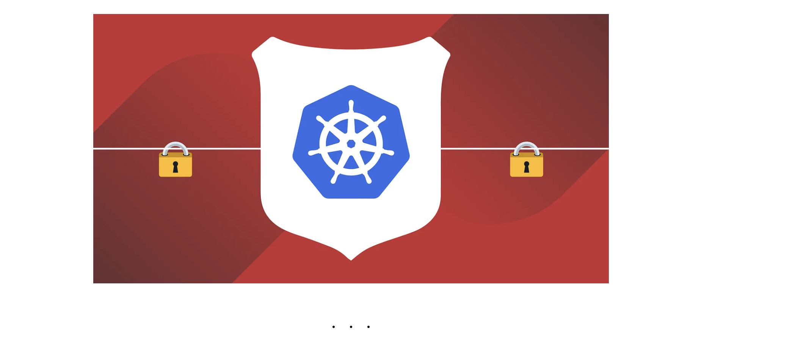

12. Explain Kubernetes RBAC.

RBAC (Role-Based Access Control) in Kubernetes restricts access to resources based on user roles.

You define Roles with specific permissions (e.g., create, delete) and bind them to users or groups using RoleBindings.

RBAC ensures users and applications have access only to necessary resources, following the principle of least privilege and enhancing security.

13. How do you perform maintenance on the K8 node?

To perform maintenance on a Kubernetes node:

- Use kubectl cordon to mark the node unschedulable.
- Evict pods gracefully with kubectl drain --ignore-daemonsets.
- Perform maintenance tasks.
- Optionally, reboot the node.
- Mark the node schedulable again with kubectl uncordon.
- Verify node status using kubectl get nodes.

14. Explain DaemonSets

DaemonSets ensure that a specific pod runs on every (or a subset of) nodes in a Kubernetes cluster. They are used for system-level tasks like logging or monitoring that need to be deployed on all nodes. Each matching node has exactly one instance of the pod created by the DaemonSet running on it.

14. A Junior Engineer working with Database on K8s is confused and asks you to Differentiate between ConfigMaps and Secret?

Config maps ideally stores application configuration in a plain text format whereas Secrets store sensitive data like password in an encrypted format. Both config maps and secrets can be used as volume and mounted inside a pod through a pod definition file.

### Config map:

```
kubectl create configmap myconfigmap
 --from-literal=env=dev


```

### Secret:

```
echo -n ‘admin’ > ./username.txt
echo -n ‘abcd1234’ ./password.txt
kubectl create secret generic mysecret --from-file=./username.txt --from-file=./password.txt


```

15. What is the purpose of Operators?

A Kubernetes operator is a method of packaging, deploying, and managing a Kubernetes application. An operator uses the Kubernetes API to automate tasks such as deployment, scaling, implementing custom controllers, enabling self-healing systems, and supporting declarative management practices.

For example, the Prometheus Operator automates the deployment and management of Prometheus monitoring instances on Kubernetes, handling tasks such as configuration, scaling, and self-healing, thereby simplifying the monitoring of Kubernetes clusters.
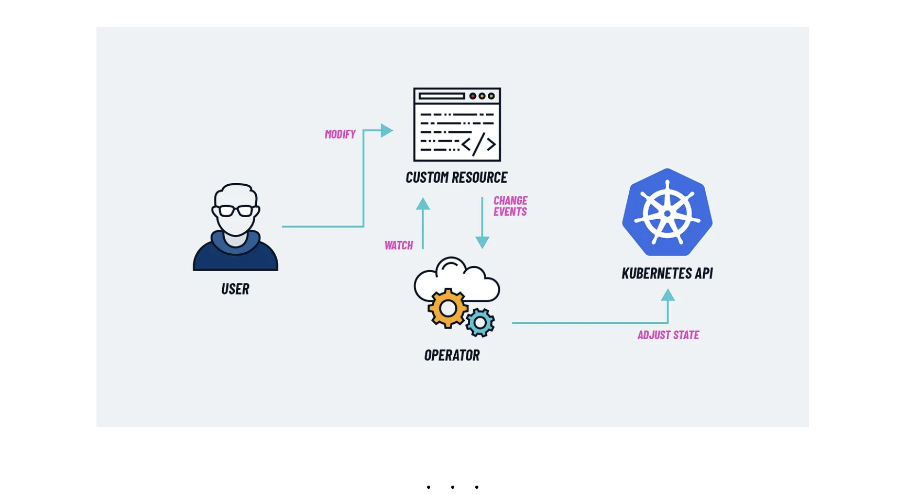

16. How can you run a pod on a specific node?

To run a pod on a specific node in Kubernetes, you can use **node affinity** or **node selectors** and also using nodeName.

For example, you can label a node (node-01) with a specific label (nodelocation=Germany) using:

```
kubectl label nodes node-01 nodelocation=Germany

```

Then, in the pod specification, specify either node affinity or node selector to ensure the pod is scheduled on that node:

```
apiVersion: v1
kind: Pod
metadata:
  name: mypod
spec:
  containers:
  - name: mycontainer
    image: nginx
  affinity:
    nodeAffinity:
      requiredDuringSchedulingIgnoredDuringExecution:
        nodeSelectorTerms:
        - matchExpressions:
          - key: nodelocation
            operator: In
            values:
            - Germany
```

This ensures the pod (mypod) runs on the node labeled with nodelocation=Germany.
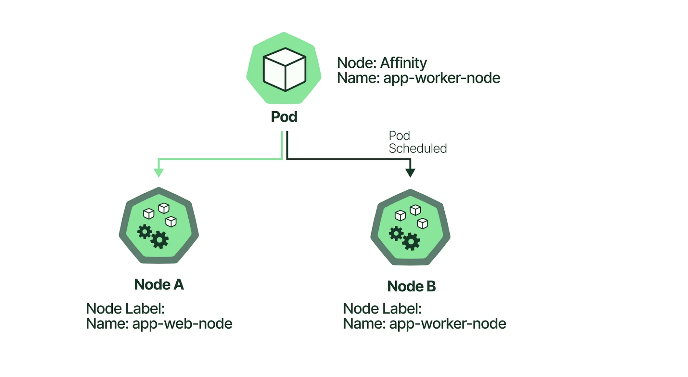

17. Suppose a pod exceeds its memory limit. What signal will be sent to the process?

When a pod exceeds its memory limit, the kernel’s out-of-memory (OOM) killer may send the SIGKILL signal to the process, terminating it immediately.

So In Kubernetes, when a container in a pod is terminated due to memory limits being exceeded, the container runtime (e.g., Docker, containerd) may send the SIGKILL signal to the main process within the container, leading to its immediate termination.
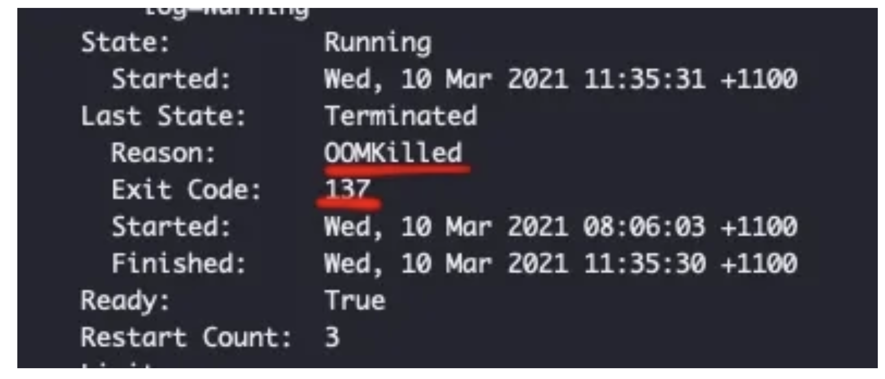

18. You need to ensure that a specific pod remains operational at all times. How to make sure that pod is always running?

This is one of the most frequently asked Kubernetes interview questions and answers for freshers in recent times. Here is how to answer this.

We can introduce probes. A liveness probe with a Pod is ideal in this scenario.

A liveness probe always checks if an application in a pod is running, if this check fails the container gets restarted. This is ideal in many scenarios where the container is running but somehow the application inside a container crashes.

```
apiVersion: v1
kind: Pod
metadata:
  name: my-pod
spec:
  containers:
  - name: liveness
    image: k8s.gcr.io/liveness
    args:
    - /server
    livenessProbe:
      httpGet:
        path: /healthz
```

19. What you will do to upgrade a Kubernetes cluster?

To update the Kubernetes cluster, one needs to update the components of the cluster. and the specific instructions to upgrade the same depends on the specific setup and configuration used with your cluster.

Here’s the upgrade process:

- First, find the desired target version and upgrade plan.
- Save crucial data and configuration by taking the backup.
- Now, upgrade the control plane components.
- Also, upgrade the worker nodes, one by one, through a rolling upgrade process.
- Finally, verify whether the cluster and the components are functioning properly.
  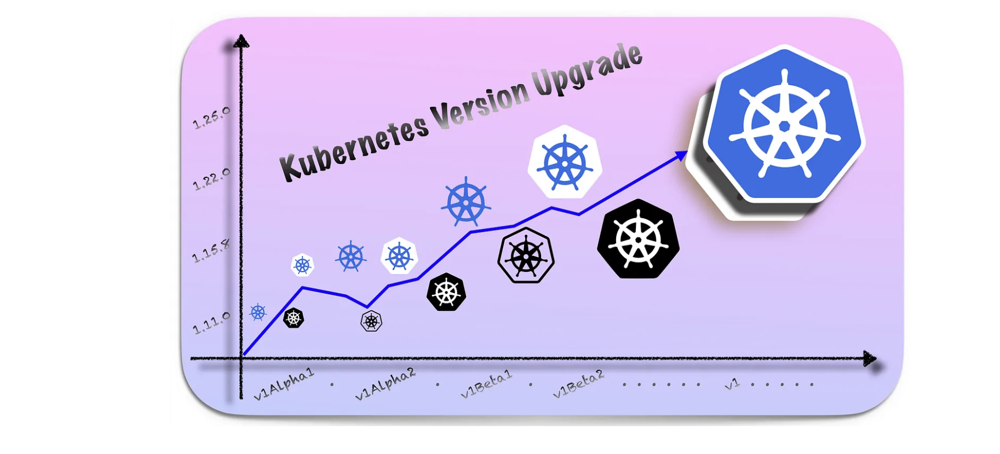

20. Why should we use custom namespaces ?

By creating custom namespaces, you can logically group your resources based on your needs, such as separating production and development environments or separating applications by team or department. This makes it easier to manage and maintain your resources within the cluster, and also provides better security and resource isolation.

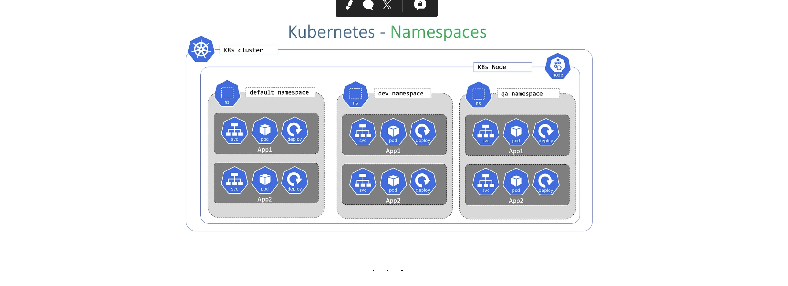

21. Can you schedule the pods to the node if the node is tainted?

If a node is tainted, pods will not be scheduled on it by default, but you can use tolerations in the pod spec to allow specific pods to be scheduled on the tainted node. Tolerations are used to specify that a pod can tolerate (or “ignore”) a certain taint, allowing it to be scheduled on a tainted node.

### Apply a taint to a node:

```
kubectl taint nodes node1 key=value:NoSchedul

```

### Apply toleration to a pod:

```
spec:
tolerations:
- key: "key"
operator: "Equal"
value: "value"
effect: "NoSchedule"


```

This can be useful in scenarios where you want to reserve certain nodes for specific types of workloads or to mark nodes as unsuitable for certain workloads.
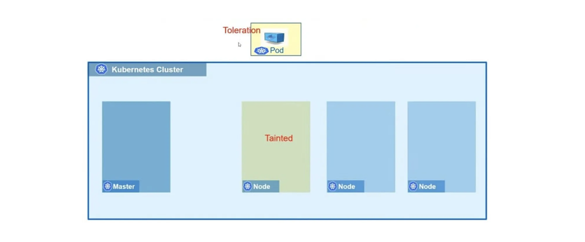

As you delve deeper into the world of Kubernetes, remember that preparation is key to success in any interview. By familiarizing yourself with these commonly asked questions and their solutions, you’re not just gearing up for interviews but also strengthening your understanding of Kubernetes concepts.

For further insights into cloud-native technologies, consider exploring
AWS Interview Questions : https://youtu.be/ULiPYBLcCiw
Docker Interview Questions : https://youtu.be/HHcgzhfuaWc
Terraform Interview Questions : https://youtu.be/8oNbpS2gcx4

DevOps Interview Questions & answers video: https://youtu.be/GX6fOvaS0Xs
